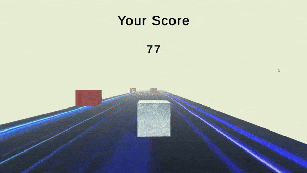

# 🎮 Cube Reflex

## Overview
**Cube Reflex** is an incredibly challenging game developed in Unity using C#. In this fast-paced game, players control a cube that accelerates as it moves forward on a dynamic floor, encountering obstacles that test their reflexes and agility.

## Game Features
- **Dynamic Movement**: The cube starts off slowly and gradually increases speed, providing a thrilling challenge.
- **Dynamic Obstacles**: The game features dynamically generated obstacles that not only appear on the floor but also adjust in difficulty based on the player’s speed. As the cube accelerates, the frequency and positioning of obstacles change, ensuring that players face increasingly complex challenges. Players must react quickly and strategically navigate these obstacles to continue progressing.
- **Engaging Gameplay**: Navigate through obstacles, aiming for the highest score by surviving as long as possible.

## Obstacles
In **Cube Reflex**, obstacles are a core gameplay element designed to challenge players' reflexes. Here's how they work:

- **Dynamic Generation**: Obstacles are generated in real-time as the cube moves forward. The game's engine places obstacles at various points on the floor, which players must navigate around.
  
- **Difficulty Scaling**: As the player's speed increases, the game dynamically adjusts the position and frequency of obstacles. This means that players will encounter more obstacles in a shorter amount of time, requiring quicker reactions and sharper reflexes.
  
- **Types of Obstacles**: There are various types of obstacles that may appear, each designed to test different skills (e.g., timing, coordination). These can include stationary blocks, moving hazards, or complex patterns that require strategic movement.

## Project Structure
The project is organized into the following folders:
- **Assets**: Contains all game assets, including models, textures, and audio files.
- **Materials**: Contains material assets to enhance the game's visuals.
- **Scenes**: 
  - **GameMenu**: The main menu scene where players can start the game or exit.
  - **GameStart**: The gameplay scene where the action happens.
- **Scripts**: Contains all C# scripts that handle game logic and functionality.

## Gameplay Instructions
1. **Game Menu**: 
   - **Start Game**: Click this button to begin the game. This will change the scene to the **Game Start** scene.
   - **Exit**: Click this button to close the game.

2. **Controls**:
   - Use the **left** and **right arrow keys** or **A** and **D** keys to move the cube. and **Space** to **Jump** 🕹️
   - Press **R** to restart the game at any time.
   - **Avoid Obstacles**: Players must skillfully maneuver the cube to avoid obstacles. Use the left and right arrow keys or A and D to navigate, keeping in mind that the obstacles become more frequent and challenging as your speed increases.


 

## Development
Created by **Vivek Tamang** (CraftedWebPro). The game showcases C# scripting in Unity to create engaging mechanics.

## Getting Started
To play **Cube Reflex**, clone or download the repository and open it in Unity. Ensure you have the necessary Unity version installed.

### Prerequisites
- Unity (version 2023.2 or higher)
- Basic understanding of the Unity interface and C#

### Installation
1. Clone this repository:
   ```bash
   git clone https://github.com/CraftedWebPro/Cube-Reflex.git
