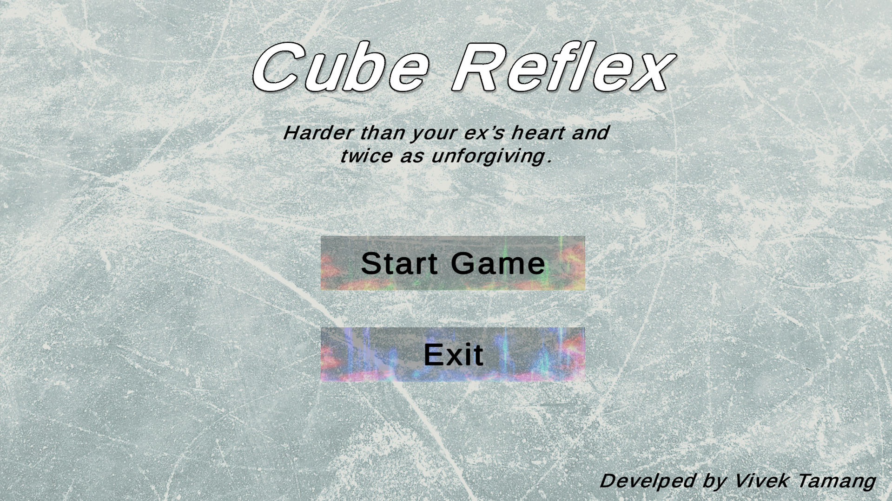

# Cube Reflex

## Overview
**Cube Reflex** is an incredibly challenging game developed in Unity using C#. In this fast-paced game, players control a cube that accelerates as it moves forward on a dynamic floor, encountering obstacles that test their reflexes and agility.

## Game Features
- **Dynamic Movement**: The cube starts off slowly and gradually increases speed, providing a thrilling challenge.
- **Obstacles**: The game features dynamically generated obstacles designed to become increasingly difficult based on the player's speed and their position on the floor. Each obstacle presents a unique challenge, requiring quick reflexes and strategic thinking.
- **Engaging Gameplay**: Players must navigate through an array of obstacles, aiming for the highest score by surviving as long as possible.

## Project Structure
The project is organized into the following folders:
- **Assets**: Contains all game assets, including models, textures, and audio files.
- **Materials**: Contains material assets used to enhance the visuals of the game.
- **Scenes**: 
  - **GameMenu**: The main menu scene where players can start the game or exit.
  - **GameStart**: The gameplay scene where the action happens.
- **Scripts**: Contains all the C# scripts that handle game logic and functionality.

## Gameplay Instructions
1. **Game Menu**: Upon starting the game, players will be presented with a menu that includes:
   - **Start Game**: Click this button to begin the game. This will change the scene to the **Game Start** scene.
   - **Exit**: Click this button to close the game.

2. **Controls**:
   - Use the **left** and **right arrow keys** or **A** and **D** keys to move the cube.
   - Press **R** to restart the game at any time.

## Screenshots and GIFs
To visualize gameplay, here’s a screenshot from the game:



## Development
The game is created by **Vivek Tamang** under the alias **CraftedWebPro**. It showcases the use of C# scripting in Unity to create engaging game mechanics and obstacle dynamics.

## Getting Started
To play **Cube Reflex**, simply clone or download the repository and open it in Unity. Make sure you have the necessary Unity version installed.

### Prerequisites
- Unity (version x.x or higher)
- Basic understanding of Unity interface and C#

### Installation
1. Clone this repository:
   ```bash
   git clone https://github.com/CraftedWebPro/Cube-Reflex.git
